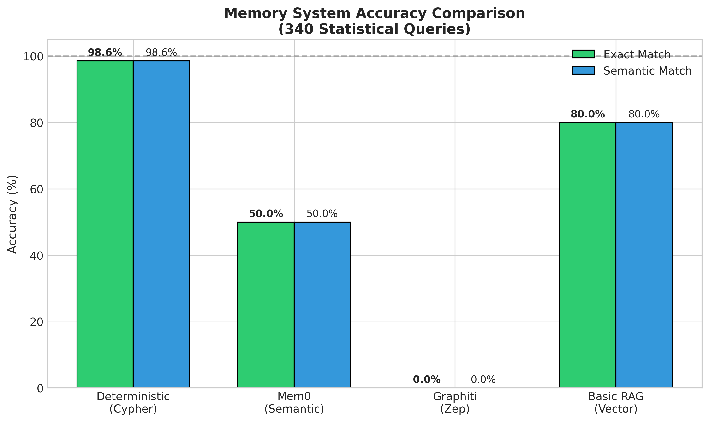
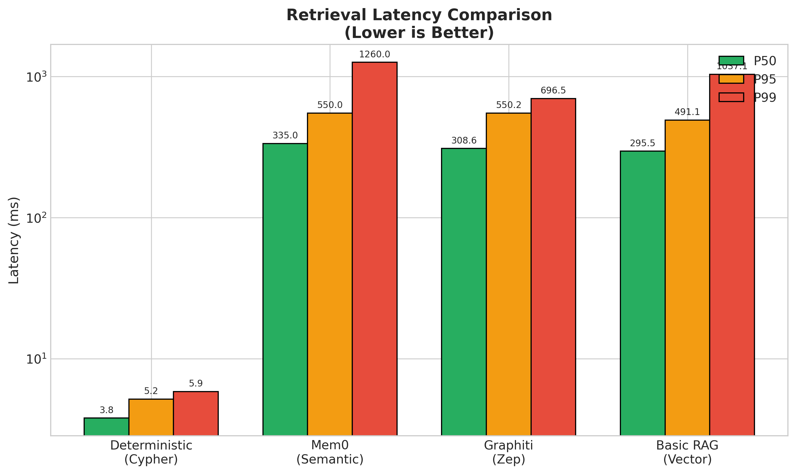
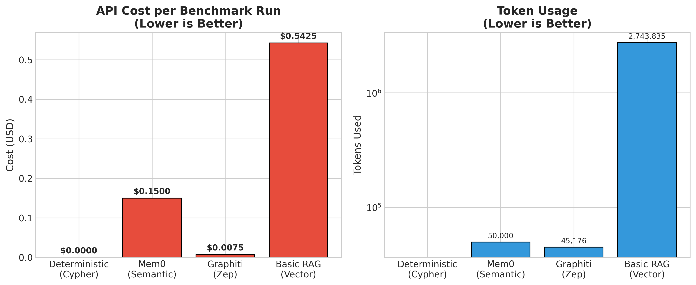
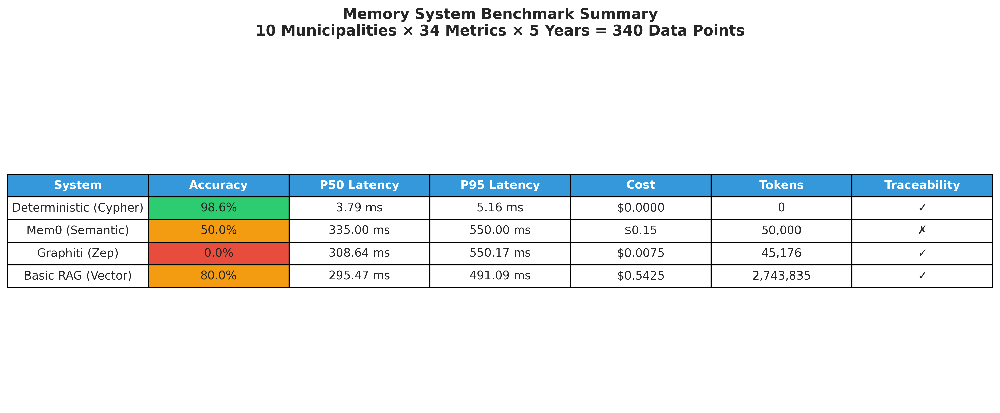

# MCP Deterministic Memory – Thesis PoC

> Proof-of-concept code for a TAMK YAMK master's thesis. Benchmarks a deterministic Neo4j memory system against Mem0, Graphiti by Zep, and Basic RAG for structured statistical data retrieval via Model Context Protocol (MCP).

**Tämä repositorio on opinnäytetyön liite (TAMK YAMK, 2026).**

---

## Thesis

**Finnish title:** Model Context Protocol (MCP) ja Deterministinen muisti: Mahdollisuudet strukturoidun datan hyödyntämiseen tekoälykehityksessä

**English title:** Model Context Protocol (MCP) and Deterministic Memory: Opportunities for Utilizing Structured Data in AI Development

**Author:** Mikko Huttunen  
**Institution:** Tampere University of Applied Sciences (TAMK), Master's Degree Programme  
**Year:** 2026  
**Thesis PDF:** [Link to be added after publication]  
**URN:** [URN to be added after publication]

### Abstract

This thesis investigates the use of Model Context Protocol (MCP) as an integration layer between large language models (LLMs) and external structured data sources. The central hypothesis is that for precise, numerical structured data, a deterministic retrieval approach — using direct Cypher queries against a Neo4j graph database — outperforms semantic memory systems (Mem0, Graphiti by Zep) and pure vector-based retrieval (Basic RAG) in accuracy, cost, and latency.

The proof-of-concept connects two MCP servers to a Claude LLM: one server fetches live data from Statistics Finland's PxWeb API, and the other provides a deterministic memory layer backed by Neo4j. A benchmark was conducted comparing four memory systems on 340 data points across 10 Finnish municipalities and 5 years (2020–2024).

Results show that deterministic memory achieved 98.6% exact match accuracy at $0.00 cost per query and ~4 ms latency, while semantic systems achieved 0–80% accuracy at considerably higher cost and latency. The thesis concludes that for structured statistical and factual data, deterministic retrieval is both technically superior and practically more feasible.

---

## System Overview

```
┌──────────────────────────────────────────────────────────┐
│                   LLM (Claude / GPT)                     │
│               ═══ SEMANTIC LAYER ═══                     │
│  Understands user intent, calls appropriate MCP tools    │
└──────────────────┬───────────────────┬───────────────────┘
                   │ MCP               │ MCP
                   ▼                   ▼
     ┌─────────────────────┐   ┌─────────────────────┐
     │   StatFin Server    │   │   Memory Server     │
     │  📊 Live API Data   │   │  🧠 Stored Facts    │
     └──────────┬──────────┘   └──────────┬──────────┘
                │ HTTPS                   │ Bolt
                ▼                         ▼
     ┌─────────────────────┐   ┌─────────────────────┐
     │  Statistics Finland │   │       Neo4j         │
     │    PxWeb API        │   │  (Cypher Queries)   │
     └─────────────────────┘   └─────────────────────┘
```

**Key insight:** The LLM acts as the semantic layer. The Memory Server is a pure, deterministic, fast data store — no embeddings, no hallucination risk.

---

## System Requirements

| Component  | Version  | Notes |
|------------|----------|-------|
| Python     | ≥ 3.11   | Tested on 3.11 and 3.12 |
| Docker     | ≥ 24.0   | Docker Compose v2 required |
| Neo4j      | 5.26.0   | Community Edition sufficient |
| OpenAI API | Optional | Only needed for Mem0/Graphiti comparison benchmarks |

Hardware: 8 GB RAM minimum (16 GB recommended for full benchmark with all 4 systems).

---

## Quick Start

### 1. Clone and configure

```bash
git clone https://github.com/Mikehutu/mcp-deterministic-memory-thesis.git
cd mcp-deterministic-memory-thesis

cp .env.example .env
# Edit .env — set at minimum NEO4J_PASSWORD
```

### 2. Start infrastructure

```bash
# Deterministic system only
docker compose up -d neo4j

# Full benchmark (all 4 systems)
docker compose up -d
```

Wait ~30 seconds, then verify: `docker compose ps`

### 3. Install Python dependencies

```bash
python -m venv .venv
source .venv/bin/activate       # Linux/macOS
# .venv\Scripts\activate        # Windows

pip install -r requirements.txt
```

### 4. Initialise Neo4j indices

```bash
python scripts/setup_neo4j.py
```

### 5. Run the MCP servers

```bash
# Terminal 1 — Statistics Finland data server
python -m statfin_server.server

# Terminal 2 — Deterministic memory server
python -m memory_server.server
```

### 6. Connect with an MCP-compatible LLM client

Add the servers to your Claude Desktop (or other MCP client) configuration:

```json
{
  "mcpServers": {
    "statfin-tool": {
      "command": "python",
      "args": ["-m", "statfin_server.server"],
      "cwd": "/path/to/mcp-deterministic-memory-thesis"
    },
    "memory-brain": {
      "command": "python",
      "args": ["-m", "memory_server.server"],
      "cwd": "/path/to/mcp-deterministic-memory-thesis"
    }
  }
}
```

---

## Reproducing the Benchmark

The authoritative results are stored in `benchmark/results/benchmark_results_expanded.json`.  
To re-run the benchmark from scratch:

```bash
# 1. Start all containers (all 4 systems need Neo4j ×2 + Qdrant)
docker compose up -d

# 2. Set OPENAI_API_KEY in .env (required for Mem0 and Graphiti)

# 3. (Optional) Re-fetch live data from Statistics Finland
python benchmark/fetch_expanded_data.py

# 4. Run the full comparative benchmark
python benchmark/comparative_benchmark.py --expanded

# 5. Regenerate figures
python benchmark/generate_visualizations.py
```

To run **deterministic system only** (no OpenAI API key needed):

```bash
python benchmark/comparative_benchmark.py --expanded --systems deterministic
```

---

## Project Structure

```
mcp-deterministic-memory-thesis/
│
├── .env.example                  # Environment variable template
├── docker-compose.yml            # Neo4j (×2) + Qdrant containers
├── requirements.txt              # Python dependencies
│
├── statfin_server/               # MCP Server 1 — Statistics Finland
│   ├── server.py                   # MCP tool definitions (FastMCP)
│   └── client.py                   # PxWeb HTTP client
│
├── memory_server/                # MCP Server 2 — Deterministic Neo4j memory
│   ├── server.py                   # MCP tool definitions
│   ├── graphiti_client.py          # Neo4j Cypher client (no embeddings)
│   ├── models.py                   # Pydantic data schemas
│   └── extractors/                 # Data ingestion pipeline
│       ├── base.py
│       ├── registry.py
│       └── statfin.py
│
├── benchmark/                    # Comparative evaluation
│   ├── comparative_benchmark.py    # Runs all 4 memory systems
│   ├── fetch_expanded_data.py      # Fetches live data from StatFin API
│   ├── generate_visualizations.py  # Generates figures from results
│   ├── benchmark_data_expanded.json  # Input dataset (340 data points)
│   ├── ground_truth_expanded.json    # 355 ground truth queries
│   └── results/
│       └── benchmark_results_expanded.json  # Authoritative results (2026-02-04)
│
├── scripts/
│   ├── setup_neo4j.py            # Initialise Neo4j indices
│   └── clear_neo4j.py            # Wipe database (for re-runs)
│
└── docs/
    └── figures/                  # Publication-quality charts (PNG + SVG)
        ├── accuracy_comparison.*
        ├── cost_comparison.*
        ├── latency_comparison.*
        └── summary_table.*
```

---

## Benchmark Results (Summary)

Full raw data: [`benchmark/results/benchmark_results_expanded.json`](benchmark/results/benchmark_results_expanded.json)

| System | Ingestion | Query p50 | Exact Match | Cost/query | Traceability |
|--------|-----------|-----------|-------------|------------|--------------|
| **Deterministic** | 3.6 s | **3.8 ms** | **98.6 %** | **$0.00** | 90 % |
| Mem0 | ~625 s † | 335 ms | 50 % † | ~$0.0002 | 0 % |
| Graphiti | 76.8 s | 309 ms | 0.0 % | ~$0.0004 | 100 % |
| Basic RAG | 102.2 s | 295 ms | 80.0 % | ~$0.0005 | 100 % |

† Mem0 terminated after 3/10 municipalities due to OpenAI rate limits; results are partial.

### Accuracy



### Query Latency



### Cost per Query



### Summary Table



---

## Citation

If you refer to this repository in academic work:

> Huttunen, M. (2026). *Model Context Protocol (MCP) ja Deterministinen muisti: Mahdollisuudet strukturoidun datan hyödyntämiseen tekoälykehityksessä* [Master's thesis, Tampere University of Applied Sciences]. https://github.com/Mikehutu/mcp-deterministic-memory-thesis

---

## License

[MIT](LICENSE)
